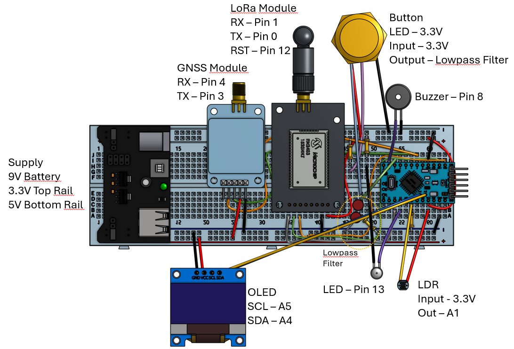

# Group 11 IoT Project: Checker, Wireless tracking system
This is the github page for Group 11s project for DTU course 34365 IoT prototyping.
## Group Members
- Andreas Nielsen: s203833
- Alexander Nordentoft: s176361
- Asger Bardrum: s204188
- Niklas Gundersen: s204191
- Oliver Jeppesen: s204180
- Gustav Thomsen: s194057

## Project Description 

The project is a wireless tracking system. The system uses the GNSS for location tracking and LoRaWAN for communication with backend and frontend. The whole system it fitted into a one box with a button on the outside. The button is used to activate the system and log the location. The system is powered by a battery. The system is designed to be used in a car, where the user can press the button when arriving at a location and when leaving. The system will then log the time and location of the user. The data is then sent to backend/frontend where it is stored. The user can then access the data through a frontend. The frontend is a web app that shows the data on a map and in a list. 

## Features  
- **Privacy by Design:** Tracking is only activated when the user presses a button.  
- **Jobsite Tracking:** Logs arrival and departure times with timestamps and geolocation.  
- **Web Interface:** View and manage logged data through a web app with map and list views.  
- **Power Efficiency:** Parts of the sytem operates in sleep mode and wakes only on button press to conserve energy.  
- **Automatic OLED Adjustment:** Uses a photoresistor to adjust OLED brightness based on ambient light.  
- **Web-App Integration:** Allows logging and data access via a web app, even away from the vehicle.  

## Use Case  
The device is ideal for craftsmen and other professionals who need to:  
1. Press the button upon arriving at a jobsite to log the start time.  
2. Press the button again when leaving to log the end time.  
3. Access the logged data later for reporting or analysis.  

## System Components  
### Hardware:  
   - Arduino Pro-Mini
   - GNSS module (NEO-7N GNSS)
   - LoRaWAN module (RN2483)  
   - Photoresistor for OLED brightness control
   - OLED display for status and data visualization
   - LED for error/success indication
   - Push-button
   - breadboard power supply module (MB102)
   - Battery for power supply  

### **Backend and Frontend**:  

#### **Python and HTML**
The backend is developed using Python and handles data processing, storage, and communication with the frontend. The frontend is built using HTML, CSS, and JavaScript, providing a user-friendly interface for viewing and managing the logged data.

- **Python App**: 

The Python application processes incoming data over MQTT fron TTN, stores it in a SQL database, and provides API endpoints for the frontend to access the data.

- **HTML Page**: 

The HTML page serves as the frontend interface, allowing users to view the logged data on a map and in a list format. It includes features for filtering and exporting data.
It live updates the data from the backend and displays it on a map (5 second polling).

#### **Azure IoT Central**

Additionally to the python backend, we have implemented an Azure IoT Central solution. The IoT Central is hooked up with the TTN backend and the data is sent to the IoT Central. The IoT Central is therefore also used to display the data and monitor the device.

## Power Management  
- GNSS and LoRaWAN modules are set to sleep mode when not in use.
- The modules wake up when the button is pressed to log the location.
- The LoRaWAN module checks for downlink messages every 10 minutes and goes back to sleep.

## Library modifications
We modified the library for the LoRaWAN module (*https://github.com/jpmeijers/RN2483-Arduino-Library*), which can be accessed in the `RN2483-Arduino_Modified_ANAN` folder. The modifications was to lower the amount of time trying to connect and send messages to the TTN backend. This was done to both save power and to make the system more responsive when no connection is available. 

## Test scripts
For testing the system without the need of GNSS connection, we have created a test script that simulates the GNSS module. The script can be found in the `NMEA_Sim_Test_ESP32` folder. The script can be uploaded to an ESP32 and will simulate the GNSS module by sending NMEA strings over serial.

## Circuit Diagram

## Video Preview of Functionality
https://github.com/user-attachments/assets/457eb75c-113f-40f2-8d50-95d4f17827c1

